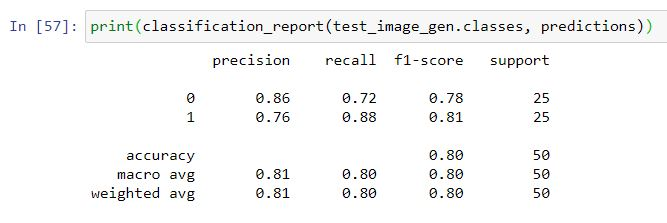
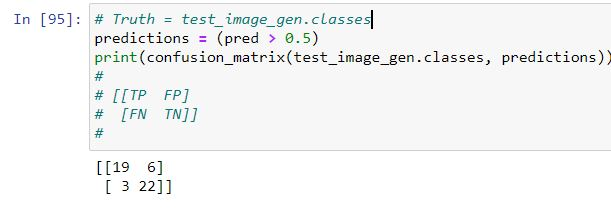
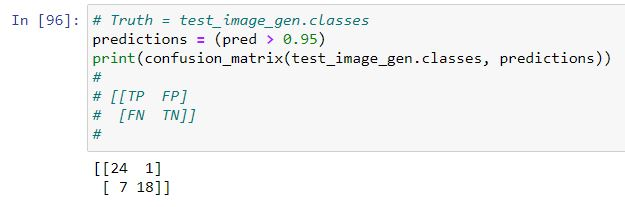
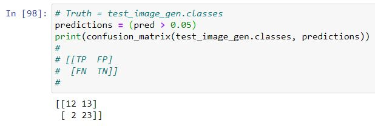

# Phat Phinder

Building off of my previous image classifer, Finding Kermit, this is basically a copy paste of the previous work with different training images.  


**The Goal**

The goal of this classifier is to identify PMC Phat Tuesday photos from PMC Non-Phat Tuesday photos.  


*note: PMC aka the Pan Mass Challenge is the best charity, supporting the Dana Farber and fighting cancer.  For more information on the PMC, I have provided a link at the bottom of this readme.*


Many teams in the PMC decorate their helmets for easy on road identification of team members.  Phat Tuesday employs various mechanisms for team identification.  Mardi Gras beads, a colorful helmet attachment thing (mask and feathers typically) and the signature riding jersey that changes slightly from year to year.


**The Training Images**

I started with a small set of cropped images.  
* training set of roughly 400 images,200 X (2 classes)
* test set of 50 images, 25 X (2 classes) 

then i augmented the training set, using
```
imgaug 
```


I ended up with

* training set of roughly 4200 images,2100 X (2 classes)
* test set of 50 images, 25 X (2 classes) 

as my final set of images

## My Results

The model did not perform well during training.  Ugly looking metrics.


But as the saying goes, 
```
all models are wrong but some are useful
```

I will continue with this ugly model and see if it can be of some use. 

I saved that best model via the checkpoint call back and reloaded that model for the below metrics.


If I set the my threshold at 50%, as a stating point, not concerned with precision or recall yet.







9 of the 50 were mis-classified

6 false positives.  Meaning 6 phat were classified as non-phat

3 false negatives.  Meaning 3 non-phat were classifed as phat


If I set the my threshold at 95%, meaning I want more precision on the classification of positive results.  My false positives should drop but I will suffer on false negatives.  More true results with slip through my precise targeting.  Casting a very small net.



1 false positive.  Meaning 1 phat was classified as non-phat

7 false negatives.  Meaning 7 non-phat were classifed as phat

If I set the my threshold at 5%
I am casting a very wide net.  trying to classify as many non-phat(s) as we can at the expense of more false positives.




13 false positives.  Meaning 13 phat were classified as non-phat

2 false negatives.  Meaning 2 non-phat were classifed as phat.  exactly the metric we were trying to minimize.

## Summary ##
This current attempt at classifying Team Phat Tuesday, based on the metrics, didn't perform very well during the training phase.  I was still able to use the model and do some classifications.  If I were pouring over tens of thousands of images (which is exactly what happens after PMC weekend), looking for my friends on Team Phat Tuesday, I believe this model will help me get to the pics quicker.

## Running My Code

**Prerequisites**

you will need the jupyter notebook
```
phat_phinder.ipynb
```
and the images
```
images/
```
and a few basic packages in your environment

* numpy
* pandas
* tensorflow 2.0
* etc...

**Optional**

If you want my exact env, you could re-create it from the provided .yml

```
conda env create -f phat_phinder.yml
```

*note: I didn't create a minimalist env specifically for this project so there will be extra packages in my env that aren't necessary so this is not recommended*


## See Also

* [Visit my linkedIn page](https://www.linkedin.com/in/therealphilwalsh/)
* [Pan Mass Challenge](https://www.pmc.org)
* [Team Phat Tuesday](https://phattuesday.org/)
