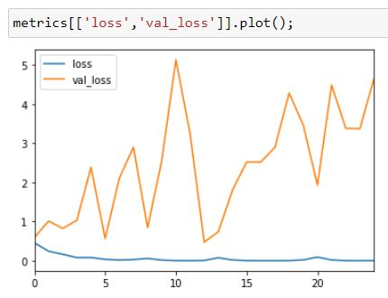

# Finding Team Phat Tuesday

Image classification with TensorFlow 2.0

**The Goal**

The goal of this classifier is to identify PMC Team Phat Tuesday photos from PMC Non-Phat Tuesday photos.  


*note: PMC aka the Pan Mass Challenge is the best charity, supporting the Dana Farber and fighting cancer.  For more information on the PMC, I have provided a link at the bottom of this readme.*

If you find this repo helpful, or if you want to be part of the solution please consider donating to the Pam Mass Challenge

[Donate to the Pan Mass Challenge](https://donate.pmc.org/BM0248/)


Many teams in the PMC decorate their helmets for easy on road identification of team members.  Phat Tuesday employs various mechanisms for team identification.  Mardi Gras beads, a colorful helmet attachment thing (mask and feathers typically) and the signature riding jersey that changes slightly from year to year.


**The Training Images**

I started with a small set of cropped images.  
* training set of roughly 400 images,200 X (2 classes)
* test set of 50 images, 25 X (2 classes) 

then i augmented the training set, using
```
imgaug 
```


I ended up with

* training set of roughly 4200 images,2100 X (2 classes)
* test set of 50 images, 25 X (2 classes) 

as my final set of images

## My Results

The model performed ok during training.  I have seen worse metrics.



The test accuracy never got above 86% but that is probably due to the fact that I began with a very small training set.


But as the saying goes, 
```
all models are wrong but some are useful
```

I will continue with this ugly model and see if it can be of some use

I saved that best model via the checkpoint call back and reloaded that model for the below metrics

Looking for a high precision on class 1

I am ok with a few class 1 being classified as class 0

I am trying to minimize class 0 being classified as class 1


My diagonals look good.

Phat Tuesdays Found
21 Class 1's predicted class 1.  True Positives.  True Phat Tuesday.

Non Phat misclassified as Phat
2 Class 0's poredicted class 1.  False Positives.  True Non Phat Tuesdays


## Summary ##
This current attempt at classifying Team Phat Tuesday, based on the metrics, performed failry well during the training phase.  I was able to use the model and do some classifications on the hold out (test) set.  If I were pouring over tens of thousands of images (which is exactly what happens during and after PMC weekend), looking for my friends on Team Phat Tuesday, I believe this model will help me get to the pics quicker.

## Running My Code

**Prerequisites**

you will need the jupyter notebook
```
finding_team_phat_tuesday.ipynb
```
and the images
```
images/
```
and a few basic packages in your environment

* numpy
* pandas
* tensorflow 2.0
* etc...

**Optional**

If you want my exact env, you could re-create it from the provided .yml

```
conda env create -f phat_environment.yml
```

*note: I didn't create a minimalist env specifically for this project so there will be extra packages in my env that aren't necessary so this is not recommended*

## See Also

* [Donate to the Pan Mass Challenge](https://donate.pmc.org/BM0248/)
* [Visit my linkedIn page](https://www.linkedin.com/in/therealphilwalsh/)
* [Team Phat Tuesday](https://phattuesday.org/)
